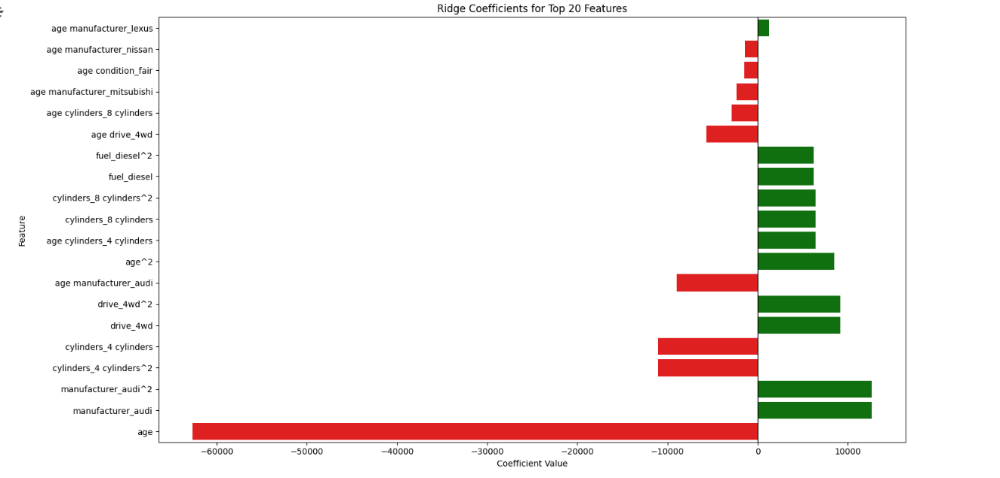
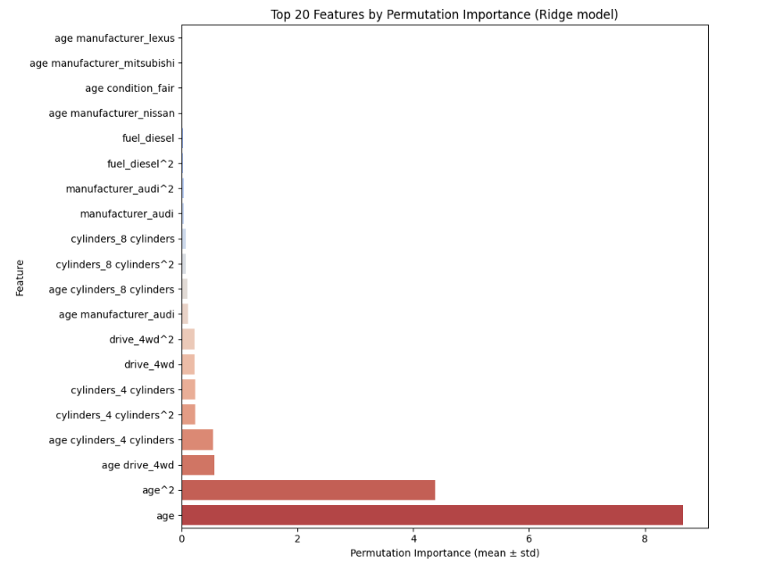

# Practical-Application-2
What Drives the Price of a Car?

Jupyter Notebook Link: [https://drive.google.com/file/d/1chgpXR7dbXlqN9I0bM9blWcbtAPk5XH-/view?usp=sharing]

## Business Understanding
Our client is a **used car dealership** that wants to maximize profits by better understanding 
what factors influence the price of a used car. 

For the dealership, they would like:
- Help with pricing strategy by knowing when they can charge more.
- Information on inventory acquisition knowing which cars to prioritize buying).  
- Improvement in marketing by highlighting features customers value most.  

### Goal
To identify **key drivers of used car prices** and translate them into **actionable recommendations** 
that the dealership can use immediately.

We are using a reduced data set of 426K cars for speed of processing instead of the original data set of 3M cars. We have a constraint of computational resources, which is why we are performing analysis on a subset of the original data set. For this analysis, we will be using google colab.

### Data Mining Goal
Determine which features of used cars result in affect the prices of cars.

## Data Understanding & Preparation
Our target (price) and numerical features (odometer and year) are skewed. There are also a great deal of NANs. In fact, around 8% of the rows in the original data do not have any NANs. 

The size column has over 70% NAN, so we dropped it. VIN is not relevant and is used to identify vehicles so it was dropped. We perform one hot encoding only to categorical variables with less categories and log transform numerical features. To improve the skewed distribution, I removed extreme outliers at the top and bottom 0.02 percentile. This kept age within 5-46, odometer within 607.88-244980.36, and target price within 396.00-57995.00.  

## Modeling

Model 1: LASSO 
CV RMSE: 8118.978719744702 
Number of selected features: 102 
Test MSE: 65,563,034.37 
Test RMSE: 8,097.10 
Test MAE: 5,356.23 
Test R^2: 0.5859 

Model 2: Ridge 
Ridge CV RMSE: 8095.686780922479 
Test MSE: 64,992,896.89 
Test RMSE: 8,061.82 
Test MAE: 5,330.55 
Test R^2: 0.5895 

I used GridSearchCV to tune different values of LASSO. The smaller the alpha, the better the accuracy, but also an increased number of features. I decided to go with 54 features at alpha=0.002 and then use Recursive Feature Elimination to get a feature set of around 20 features. 

Model 3: LASSO + Recursive Feature Elimiation with Ridge with final 20 features 
CV RMSE: 8181.5441706488755 
Test MSE: 66,997,007.09 
Test RMSE: 8,185.17 
Test MAE: 5,565.62 
Test R^2: 0.5769 

I took the top 20 features after LASSO and RFE with Ridge and calculated polynomial features. This way, I could see if any interactions between categorical and numerical features exist and it is tractable to do so with less features. With all of the polynomial features, I was able to get RMSE of 7,263.39 or R^2 of 0.6668 which is my best model accuracy.  
Model 4 
Test MSE: 52,756,856.09 
Test RMSE: 7,263.39 
Test MAE: 5,100.48 
Test R^2: 0.6668 

There were too many features, so I used permutation importance to get the top 20 features. Ridge regression showed that the accuracy did not drop that much even with the top 20 features. This shows that these top 20 features capture most of the variance in the car prices. 
Model 5:  
Performance with top 20 expanded features: 
Test MSE: 61,786,918.77 
Test RMSE: 7,860.47 
Test MAE: 5,706.08 
Test R^2: 0.6098 

## Findings & Recommendations

  

  

**Findings**

Age is the dominant factor. Older cars generally have lower prices. The relationship is non-linear: depreciation is faster at younger ages, then slows down (captured by the age^2 term).

Vehicles with 4WD tend to have higher prices than 2WD, especially for SUVs, trucks, and higher-end vehicles. Older 4WD vehicles depreciate more slowly than 2WD vehicles, preserving value longer.

Cars with 4 or 8 cylinders tend to command higher prices depending on interactions with age and drive type.

Diesel fuel slightly increases price

Premium brands like Audi and Lexus are associated with higher prices. Brands such as Nissan and Mitsubishi are linked with lower prices. Brand effects are less influential than age but still important for pricing strategy.

**Next Steps and Recommendations**

* Prioritize younger vehicles with slower depreciation curves (captured by age^2 effects).

* Focus on 4WD vehicles, especially SUVs and trucks, as they maintain higher prices over time.

* Vehicles with 4 or 8 cylinders tend to command higher prices—consider emphasizing these in inventory.

*Brands*

* Audi and Lexus vehicles consistently sell at higher prices—consider allocating more inventory to these brands.

* Be cautious with Nissan and Mitsubishi, which tend to sell at lower prices; avoid overstocking unless the goal is fast turnover.

*Fuel Type*

* Diesel vehicles slightly increase in value—especially if paired with 4WD or high-cylinder engines.

* Use fuel type strategically for vehicles targeted at long-distance drivers or niche markets.
